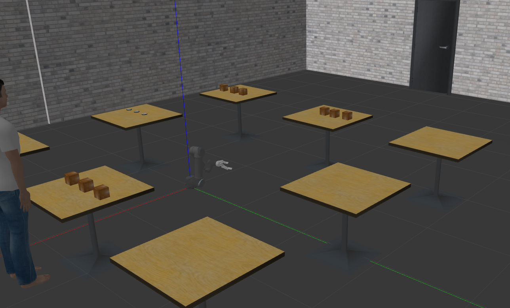

# Collaborative Robotic Manipulator
Author: Naveen Anil <br>
Email: nvnanil@umd.edu



## Installing the dependencies
```
ROS Noetic 
Ubuntu 20.04 
Gazebo 11
Rviz 
Moveit Setup Assistant 
Python3,x
```

*To install Sympy*
```
pip install sympy
```
*To install Numpy*
```
pip install numpy
```
*To install Mathplotlib*
```
pip install matplotlib
```
## Package structure:
```
CmakeLists.txt
config -contains the .yaml files with the information regarding the controllers
launch -contains launch files to launch the robot in rviz and gazebo
meshes -contains the information regarding the meshes for the robot and lidar
package.xml
scripts -codes to control the robot through open loop controller
textures
urdf -contains .urdf file for the robot
world -contains file to open the simulated gazebo world
robot_arm_moveit_package - contains the package generated through move-it setup assistant
solidworks: contains the CAD models used to generate the URDF files
```
## Running the code
```
Export the package 'manipulator' to the catkin_ws/src
cd catkin_ws
catkin_make To build the package
 
1)Spawn robot in gazebo
cd catkin_ws
roslaunch manipulator gazebo.launch

2)Spawn robot in rviz
cd catkin_ws
roslaunch manipulator display.launch

3)Spawn robot in world file
cd catkin_ws
roslaunch manipulator manipulator_arm.launch

4)Using the open loop controller to control the robot
cd catkin_ws
roslaunch manipulator manipulator_arm.launch
In a new terminal >> cd src/manipulator/scripts
python3 ikcode.py

5)Using moveit to validate robot movement
cd catkin_ws
roslaunch robot_arm_moveit_package demo_gazebo.launch
Select pick and place orientations and hit 'Plan'

```


